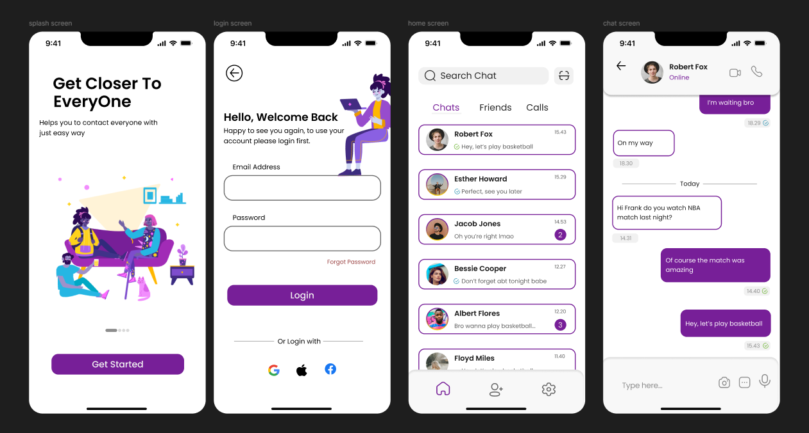
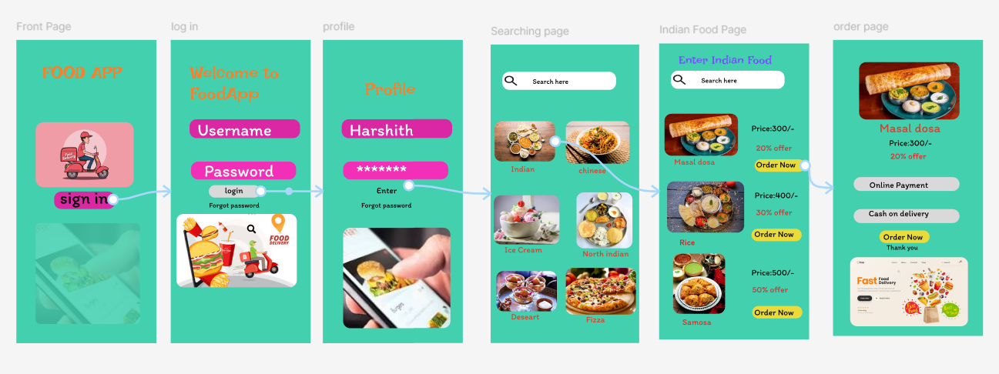
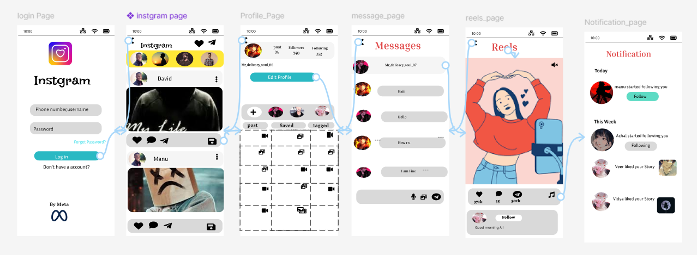
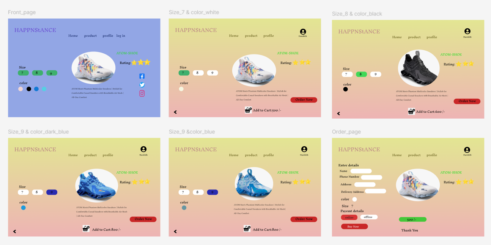
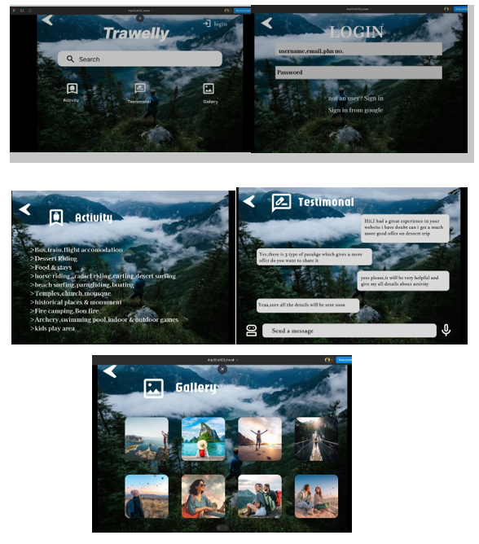
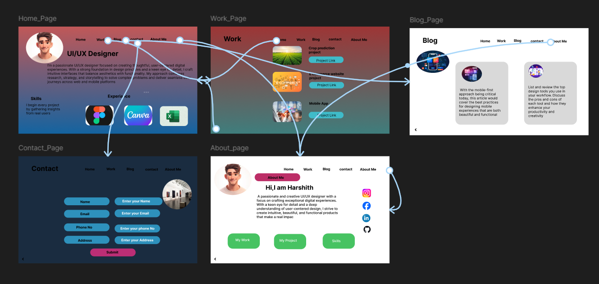
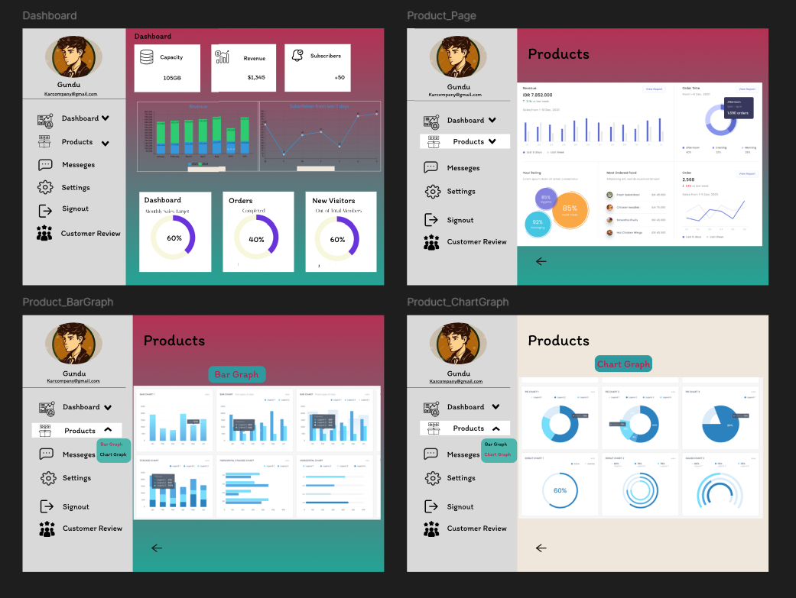
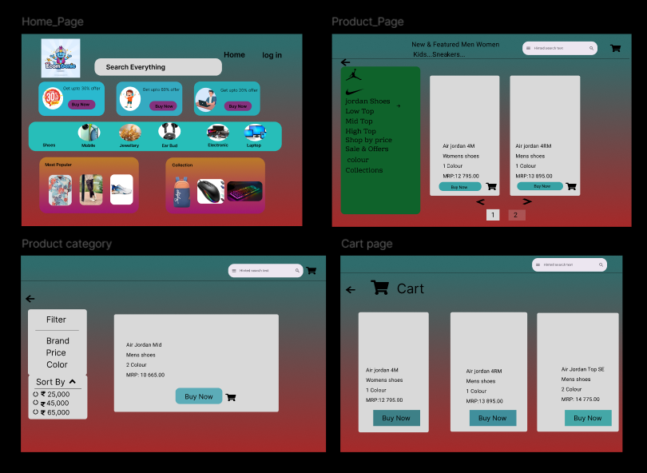
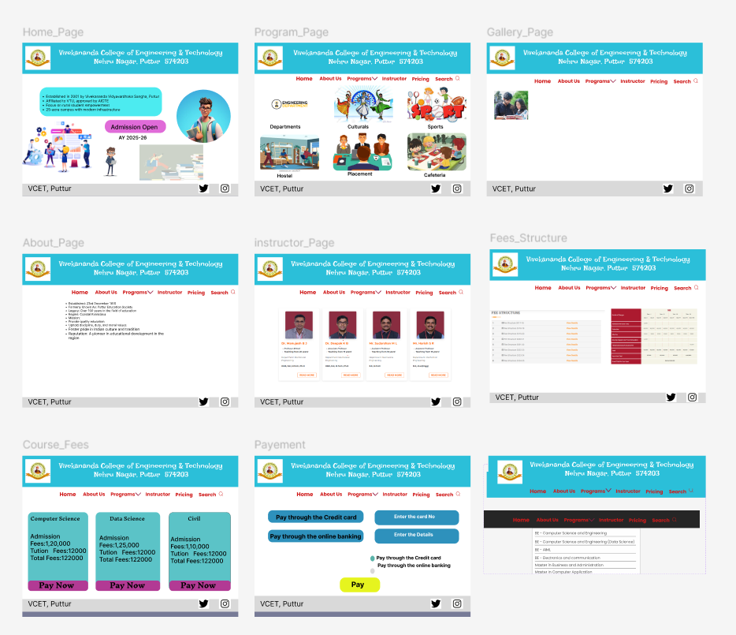
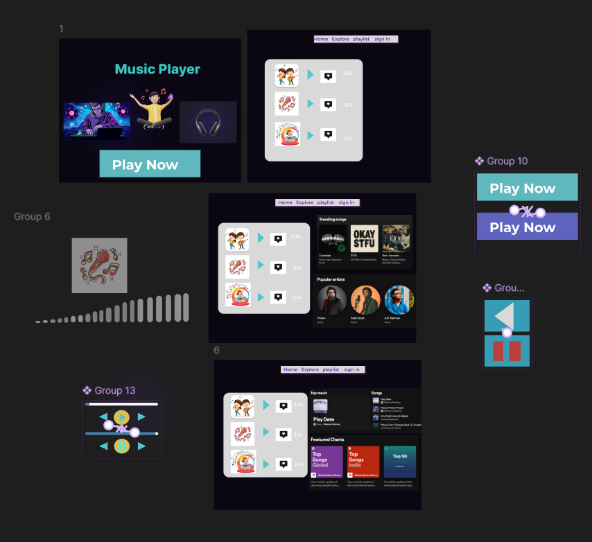

# 🎨 UI/UX Laboratory – Figma Projects

---

## 🧪 Experiments

### 1. Chat App Redesign
Redesign of a chat app (e.g., WhatsApp) with improved layout and navigation.  

### 2. Food App
UI/UX design for a food ordering application.  

### 3. Social Media App
Photo-sharing social platform interface.  

### 4. Product Website
Interactive product showcase website.  

### 5. Travel Agency Website
Travel booking website with search, activities, and testimonials.  

### 6. UI/UX Designer Portfolio Design
Personal portfolio website for UI/UX designers.  

### 7. Dashboard Design
Analytics dashboard with graphs, dropdowns, and data views.  

### 8. E-Commerce Website
Product listing and shopping flow design.  

### 9. Educational Website
Institution website with courses, instructors, and payment UI.  

### 10. Music Player App
Interactive music player with animations and responsive UI.  

### 10. Music Player App
Redesign the Company Profile Page with the goals of making it:
● Easy to scan and understand at a glance
● Simple to navigate between related sections (Contacts, Jobs, Candidates, Activities,
etc.)
● Efficient for recruiters to perform daily actions (logging a call, adding a job, viewing
history) 
![comany Screenshot]([company_profile.png]

---

